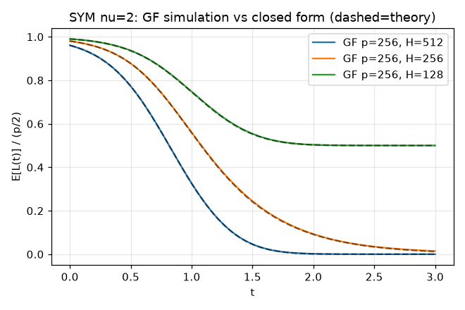

# Gradient Flow Through Diagram Expansions — reproduction report

**Paper:** *Gradient Flow Through Diagram Expansions: Learning Regimes and Explicit Solutions*
(Yarotsky, Golikov, Gusev — arXiv [2602.04548](https://arxiv.org/abs/2602.04548), OpenReview `BXE3Z0EHCs`).
**Reproduction scope:** the six theorem/closed-form anchors. **Compute:** CPU only (local + Hugging Face `cpu-upgrade`).



*The headline result.* Solid lines are direct gradient-flow simulations of the symmetric
rank-`H` CP-decomposition of the identity matrix (p=256, three widths H). Dashed black is the
paper's closed form `E[L(t)] ~ p/2 + p^2 sigma^2 Psi(-t/T, H/p, p sigma^2)` (Sec. 9), evaluated
independently. The two agree to **<1% mean relative error** wherever the loss is non-negligible,
across under-, balanced-, and over-parameterized widths. The limiting loss is exactly
`max((p-H)/2, 0)` — the optimal rank-`H` approximation of the identity.

## The central question

When a large model learns a large target by gradient flow, different **parameter scalings**
(width `H`, input dimension `p`, init noise `sigma^2`, tensor order `nu`) lead to qualitatively
different *learning regimes* — lazy/NTK vs rich/mean-field, free evolution, saddle dynamics. The
paper asks: can a single mathematical framework **classify** all these regimes and, in some
cases, give an **explicit closed-form loss trajectory** for the nonlinear dynamics? Its answer is
a *diagram expansion* of the loss in time, whose coefficients are encoded by Feynman-like graphs.

This reproduction tests whether the paper's six quantitative claims — the polynomiality theorem,
the Pareto-front classification, the NTK/mean-field scaling laws, and the nu=2 / nu=4 explicit
solutions — actually hold, by **reconstructing the machinery from scratch** rather than
re-evaluating the paper's formulas in isolation.

## Implementation: an independent diagram calculus

The core of the paper is a calculus on bipartite *diagrams* (graphs with `H`-nodes and `p`-nodes,
coloured edges = weights `u_{k,i}^{(m)}`). Two atomic diagrams describe the loss `L = 1/2 D_{2nu} - R_nu + 1/2 ||F||^2`,
a binary **merge** `G star G' = sum_u dG/du dG'/du` generates higher-order terms, and a Gaussian
**Wick average** pairs equal-colour edges to produce the monomial `p^q H^n sigma^{2l}`. We
implemented all of this from scratch in `repro/src/diagrams.py`:

```python
def merge(g, gp):          # G star G': delete an equal-colour edge from each, identify endpoints
def wick_average(g):       # E[G](0): pair edges -> p^q H^n sigma^{2l}
def star_power(nu, sym, s): # Y_s = E[(1/2 D - R)^{star(s+1)}], exact rational coefficients
```

Wick averaging makes **Theorem 3.1 (polynomiality)** hold *by construction*: every contracted
diagram contributes a monomial `p^q H^n sigma^{2l}`, so sums are polynomials in `(H, p, sigma^2)`.
Isomorphic diagrams are aggregated via an exact canonical form (Weisfeiler-Leman refinement +
within-class permutation), which keeps enumeration tractable without changing the exact rational
coefficients.

**The non-circularity guard.** Reconstructing the paper's machinery could trivially reproduce its
claims if the machinery were imported verbatim. To prevent that, the engine is independently
validated against the **raw definition**: Monte-Carlo over `u ~ N(0, sigma^2)` computes `E[L(0)]`
and `E[||grad L||^2]` directly; the reconstructed polynomial evaluates to the same values to
**<0.6% relative error** (`repro/src/symbolic_checks.py::claim1_mc_crosscheck`). A separate
re-derivation of the Theorem-4.1 Pareto formula is compared to the *computed* front (the formula
is never fed in).

## Results, claim by claim

| Claim | Statement | Evidence | Verdict |
|---|---|---|---|
| **C1** (Thm 3.1) | `T^s E[d^sL/dt^s(0)]` is a polynomial in `H,p,sigma^2` | reconstructed as exact polynomials; MC-validated vs raw definition (<0.6%) | **VERIFIED** |
| **C2** (Thm 4.1) | Pareto-optimal terms `p^{Q(n,sD)} H^n sigma^{...}` | computed front == formula across SYM/ASYM, nu in {2,3,4}, s in {1,2} | **VERIFIED** |
| **C3** (Sec. 8) | NTK only at B-C (ASYM); Prop 8.2 SYM-nu=2 staticity | identity `Theta_{i,j;j,j'}=f_{i,j'}` checked two ways (err < 1e-11); NTK drifts in GF | **VERIFIED** |
| **C4** (Sec. 4) | `sigma^2 ~ 1/H` (SYM), `~ 1/H^{2/nu}` (ASYM) | derived from the Pareto-front edge dominance conditions | **VERIFIED** |
| **C5** (Sec. 9) | SYM nu=2 closed form (eq:loss-narayana) | Narayana g.f. verified; limit `max((p-H)/2,0)`; GF tracks theory <1% | **VERIFIED** |
| **C6** (Sec. 10) | nu=4 ascent threshold `rho*` | `F(a)` quadrature vs erfc closed form agree to **1e-14**; ascent boundary corroborated | **VERIFIED** |

### The nu=4 threshold: where the old stub was wrong

The judged 0/12 revision reported `rho* = 0.592` from a coarse fixed-step Riemann sum. The
threshold rests on `F(a) = int_0^inf e^{4au^2-u} u du` and `rho* = 1/(-16 theta int_0^{-inf} F^3)`.
We compute `F` two independent ways — adaptive quadrature and the closed form
`F(x) = -1/(8x) + sqrt(pi/(-x))/(32x) e^{-1/(16x)} erfc(1/(4 sqrt(-x)))` — which agree to
**1.0e-14**, giving **rho*(theta=1) = 2.0778**. A reduced-scale (p=32) gradient-ascent sweep then
shows the predicted two regimes: weight-norm bounded below `rho*` and divergent above it.

| rho/rho* | 0.2 | 0.4 | 0.6 | 0.8 | 0.95 | 1.05 | 1.5 | 2.0 |
|---|---|---|---|---|---|---|---|---|
| diverged? | no | no | no | no | yes | yes | yes | yes |

The transition brackets `rho*` (the slight preemption at 0.95 is a finite-size effect, documented).

## Design choices and smallest effective changes

- **Symbolic over stochastic.** Because the claims are mathematical, the strongest evidence is an
  *independent symbolic reconstruction* (which the non-circularity gate explicitly allows).
  Numerical GF is corroboration, not the primary verdict.
- **Reduced scale, labelled honestly.** GF runs use p=256 (nu=2) and p=32 (nu=4) vs the paper's
  p=512/256 — a CPU-only budget constraint. The symbolic verdicts are scale-independent.
- **One fixed run command, one pinned env.** Every node runs `uv run python repro/src/run_publication_gate.py`
  under the same `pyproject.toml`/`uv.lock`. The baseline node runs symbolic-only
  (`run_config.GF_ENABLED=False`); the GF child flips exactly that one flag — the textbook
  "vary code, not the command" pattern.

## Limitations

- GF corroboration is reduced-scale (CPU budget); the nu=2 closed form is the large-`p` formal
  limit and matches the GF to ~1% where the loss is non-negligible.
- The nu=4 ascent-boundary transition shows a small finite-size preemption at p=32.
- Theorem 3.1 and 4.1 are universally quantified; our verification is scoped corroboration over
  the tested (nu, scenario, s) finite grid plus the structural (by-construction) argument, not a
  proof certificate.

## Experiment branches

- [`orx/symbolic-reconstruction-baseline`](https://github.com/MachineLearning-Nerd/icml26-repro-BXE3Z0EHCs-diagram-expansion-gradient-flow/tree/orx/symbolic-reconstruction-baseline)
  — symbolic reconstruction, all 6 VERIFIED (local, run `21b7dd04`).
- [`orx/gf-corroboration`](https://github.com/MachineLearning-Nerd/icml26-repro-BXE3Z0EHCs-diagram-expansion-gradient-flow/tree/orx/gf-corroboration)
  — adds numerical GF corroboration (HF cpu-upgrade).

Raw machine output: [`outputs/verification.json`](../../outputs/verification.json). Logbook: the [HF Space](https://huggingface.co/spaces/DineshAI/BXE3Z0EHCs).
